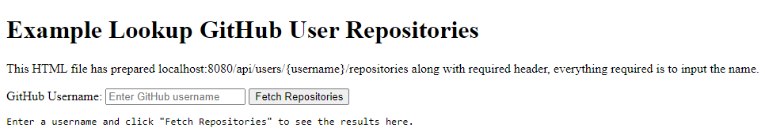
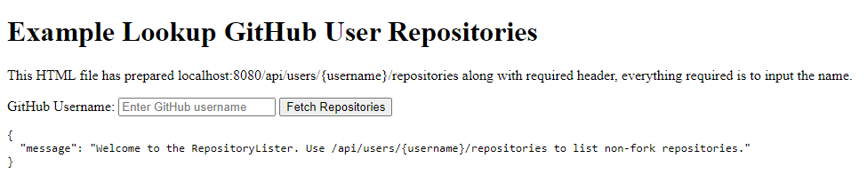
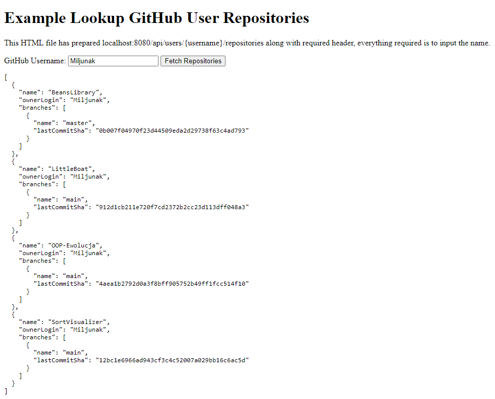
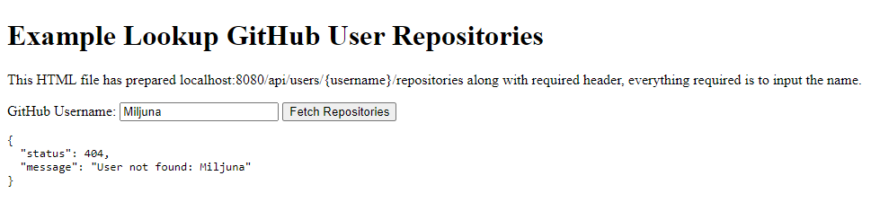
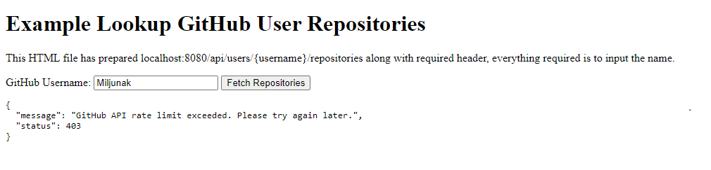

# RepositoryLister
Project has been written in Java in Spring Boot with Maven.

This project showcases usage of GitHub API to list all user's non-forked repositories and every branch inside them along with most recent commit sha.

To easily present how the Spring Application replies there is example.html file which presents itself as follows.

In case that wrong endpoint is used (or in case of example.html just no entered username) following message shows up.

Correctly using it should provide correctly listed user's repositories as well as branches and commits.

Trying to find a user that does not exist gives following results.

If user has exceeded GitHub APIs hourly rate (which is quite small) application will return following.

This issue can be easily solved after putting GitHub API token in application.properties, then hourly limit will be 5000.
